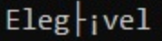
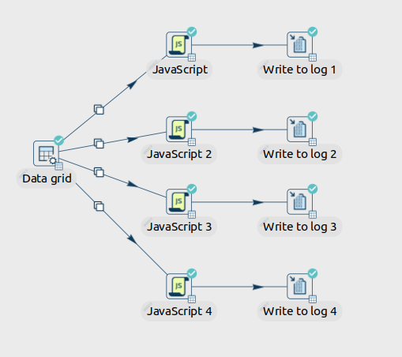

# Apache Hop
## Javascript decoder Base64
A client of ours was issues with the base64 decoder in the Apache Hop calculator.  
When a word contains accent or special character, the calculator broken the word, as shown below.

> [!NOTE]
> "Elegível" turns into  
> <picture>
>  <source media="(prefers-color-scheme: dark)" srcset="images/issue_base64.png">
>  <source media="(prefers-color-scheme: light)" srcset="images/issue_base64.png">
>  
>  </picture>

We have created four optional javascript codes. If you are facing the same issue, you can test the pipeline ["decodes64.hpl"](pipelines/base64/decodes64.hpl) and choise the option that works best for you.

> [!TIP]
> the pipeline preview as shown below.
> <picture>
>  <source media="(prefers-color-scheme: dark)" srcset="images/pipeline.png">
>  <source media="(prefers-color-scheme: light)" srcset="images/pipeline.png">
>  
>  </picture>

## Requirements
Apache Hop 2.4 or+

# Developed by Ambiente Livre
https://www.ambientelivre.com.br
 developer Miguel Vieira 
