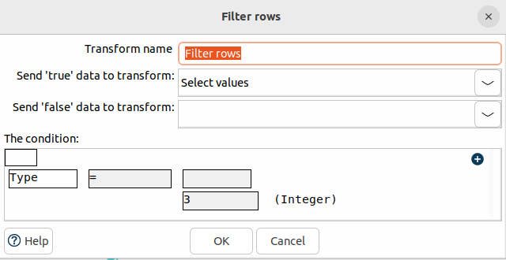
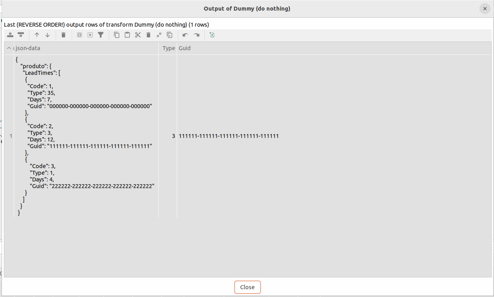
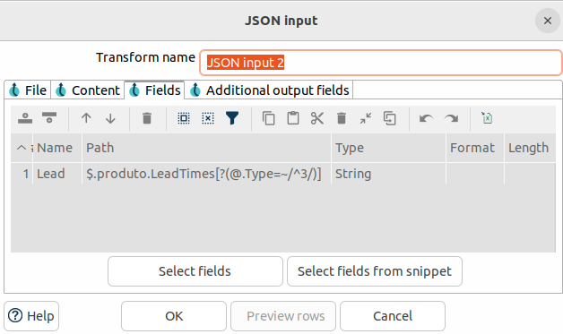
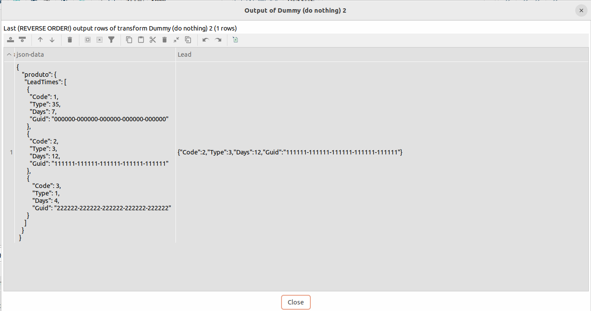
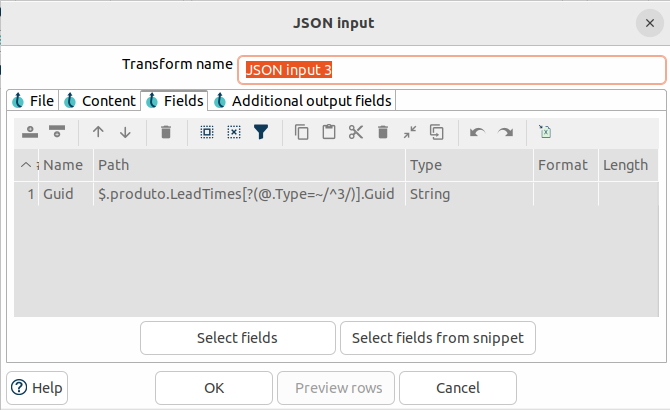
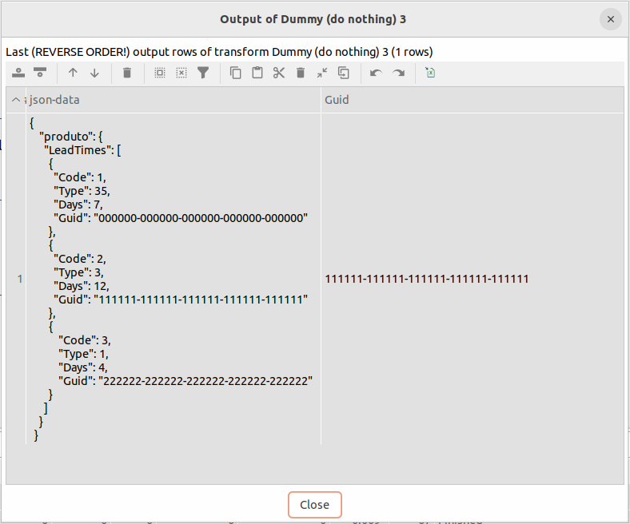
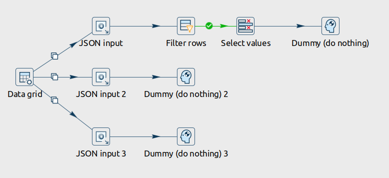

# Apache Hop – JSON Filtering with Regex

This example demonstrates different ways to filter JSON data in **Apache Hop**.

## Use Case

A client needed to extract a specific field from a JSON structure.  
However, this field should only be returned when another value in the same JSON meets a condition.

Example:

Return the **Guid** only for products where **type = 3**.

---

# Solution 1 — Using JSON Input + Filter Rows

One approach is to extract the JSON fields and then apply a **Filter Rows** step.

### Filter Rows configuration

### Result

Only products with `type = 3` are returned.

---

# Solution 2 — Filtering using Regex (Full Product)

Another approach is to use **Regex directly in the JSON Input step**.

This allows filtering while returning **all product fields**.

### JSON Input configuration

### Result

---

# Solution 3 — Filtering using Regex (Guid only)

You can also use Regex to return **only the Guid** for products where `type = 3`.

### JSON Input configuration

### Result

---

# Pipeline Overview

> Tip: The following image shows the complete pipeline used in this example.

---

# Apache Hop Version

This pipeline was created and tested with:

**Apache Hop 2.11.0**

---

# Author

Developed by **Ambiente Livre**

https://www.ambientelivre.com.br

Developer: **Miguel Vieira**